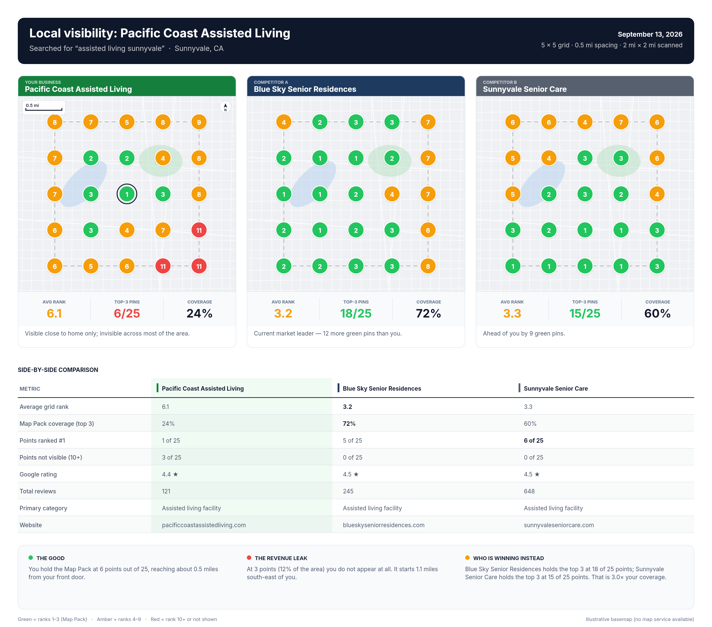

# Geo-Grid Rank Report

Generates a 5 × 5 (25-point) local SEO geo-grid ranking report and turns it into an outreach
asset: a three-panel comparison sheet putting the business beside two rivals, a detailed grid
of its own, and a plain-English "client takeaway" you can paste into an email.

**One scan, three panels.** A local-pack lookup at a grid point returns the whole pack, so the
lead business and both rivals are read out of the *same* 25 calls. The comparison sheet costs
exactly what a single-business audit costs.



Runs as a small Express web app **or** a one-line CLI. No build step, no database.

**Not technical?** Read [GETTING-STARTED.md](GETTING-STARTED.md): double-click launchers for
Mac/Windows, or a one-click Render deploy. All keys are entered on the in-app **Settings** page.

## Quick start

```bash
npm install
cp .env.example .env        # defaults to mock ranks + OpenStreetMap basemap, no keys needed
npm start                   # http://localhost:3000
```

Fill in the composer, leave **Mock mode** checked, hit **Run Grid Audit**. You get the
comparison sheet, your own detailed grid, the scoreboard, the takeaway text, a
*Copy Email Summary* button and PNG/PDF downloads.

### The composer

| Section | Fields |
| --- | --- |
| **A · The business** | Name, City/State (or zip), optional street address. The address is used to pin the exact listing when several share a name. |
| **B · Competitors** | Two optional names. Leave them blank and the two businesses holding the most ground across your 25 points are picked automatically. |
| **C · Parameters** | Keyword, grid spacing (0.5 / 1 / 2 miles), and an advanced `lat,lng` override. |

Websites, ratings, review counts and primary categories are pulled in while the listings are
resolved, and fill the side-by-side table. Anything a provider does not return shows as `—`
rather than being invented.

API keys can go in `.env` **or** in the in-app **Settings** page (saved to `data/settings.json`,
which overrides `.env`). **Settings → Check setup** runs one test call per configured service.
Set `APP_PASSWORD` to put the whole app behind a password when hosting it.

### Hosting

`Dockerfile` and `render.yaml` are included. On Render: New + → Blueprint → this repo. The
blueprint generates an `APP_PASSWORD` for you.

### CLI

```bash
node src/cli.js --business "Pacific Coast Heating & AC" --location "San Jose, CA" \
  --keyword "furnace repair near me" --spacing 0.5 --mock

# name the rivals yourself, pin the listing with a street address
node src/cli.js -b "Pacific Coast Assisted Living" -l "Sunnyvale, CA" -a "1250 Elm St" \
  -k "assisted living sunnyvale" --live \
  --competitor "Sunrise Senior Living of Sunnyvale" --competitor "The Terraces of Los Altos"

# fully offline (no tiles, no geocoding): give the coordinates and the procedural basemap
node src/cli.js -b "Test HVAC" -l "San Jose, CA" -k "ac repair" -c "37.3382,-121.8863" --map none --mock
```

The email-ready takeaway prints to stdout; progress and file paths go to stderr, so
`node src/cli.js … > pitch.txt` just works. Outputs land in `output/` as
`<business>_<keyword>_<timestamp>.{png,pdf,json,txt}`.

## How it works

1. **Resolve the listing.** With `GOOGLE_PLACES_API_KEY` set, Google Places (New) Text Search
   returns the exact GBP title, coordinates and Place ID. Otherwise the rank provider's own
   Maps search is used, and in mock mode the address is geocoded. You can always bypass this
   with a `lat,lng` override (form → Advanced, or `--coordinates`).

   Geocoding fails over across four keyless services in order — Zippopotam (postal codes),
   Photon, Open-Meteo, then Nominatim. Nominatim is last because it 403s VPN and datacentre
   IPs, which made it a single point of failure. Results are cached in `.cache/geocode.json`,
   and a service that cannot handle an input (a postal-code service given a city name) opts
   out rather than counting as a failure.
2. **Build the grid.** `src/geometry.js` lays out 25 points on a spherical-earth offset,
   centred on the listing (index 12 = `[2,2]`), at 0.5 / 1 / 2 mile spacing.
3. **Rank each point.** Every point runs one Google Maps search *from that coordinate*, and the
   top 20 results are kept. Each of the three businesses is then located in that same list by
   Place ID / CID, falling back to fuzzy title match. Rank `null` means not in the top 20 and
   renders as **20+**.

   If competitors were not named, `rankRivals` scores every business seen anywhere on the grid
   by Σ(21 − rank) — which rewards ranking well *and* often — and takes the top two.
4. **Metrics + takeaway.** Average rank (20+ counts as 21), Top-3 share, and the competitor
   that most often holds #1 where you are not in the Map Pack. `src/takeaway.js` turns the
   grid into "The Good / The Revenue Leak / The Competitive Context" using distances and
   compass directions from the grid itself.
5. **Render.** `src/render.js` draws the card with `@napi-rs/canvas` (bundled Inter font, so
   output is identical on every machine) on top of a muted basemap stitched from map tiles.
   The map carries a scale bar, a north arrow, a dashed outline of the scanned square and a
   dimension bracket labelled with the area covered, all derived from the real projection
   rather than assumed. Default export is 2400 px wide; the PDF adds a second page with the
   takeaway text.

## Rank providers

| `RANK_PROVIDER` | Needs | Notes |
| --- | --- | --- |
| `mock` (default) | nothing | Deterministic per business + keyword. Builds a market of ~27 businesses, then *calibrates* their strengths so the three panels land on "Scenario A": the lead holds about 6 green pins with a red outer edge, while the two rivals hold about 18 and 15. That is the shape the sheet exists to show, so the layout is always tested against it. Typed competitor names are ignored in mock mode — a real company's name on invented numbers would be misleading. |
| `dataforseo` | `DATAFORSEO_LOGIN`, `DATAFORSEO_PASSWORD` | `serp/google/maps/live/advanced` with `location_coordinate = "lat,lng,15z"`. 25 tasks per audit. |
| `serpapi` | `SERPAPI_KEY` | `engine=google_maps` with `ll=@lat,lng,15z`. 25 searches per audit. |

Both live adapters live in `src/providers/` and share the same shape
(`resolveBusiness()` + `createRanker()` returning a ranked list), so adding another vendor is
one file. `RANK_CONCURRENCY` bounds parallel calls. The UI's mock toggle overrides the
provider per run; when no live credentials are present it is forced on.

## Basemaps

| `MAP_PROVIDER` | Needs | Look |
| --- | --- | --- |
| `carto` (default) | nothing | CARTO Positron light tiles at 2×. Already muted. |
| `esri` | nothing | Esri World Light Gray Canvas. Keyless second choice; caps at z16. |
| `mapbox` | `MAPBOX_TOKEN` | Static Images API, `mapbox/light-v11` by default. Best looking, one request, fractional zoom, and the only option whose terms clearly cover commercial volume (~50k images/month free). |
| `osm` | nothing | Standard OpenStreetMap tiles. **Never selected automatically.** Volunteer-run servers whose tile usage policy does not cover bulk or commercial use. |
| `none` | nothing | Procedural street pattern. Last resort so a report always renders. |

Providers fail over in order: the configured one, then `carto`, then `esri`, then the offline
pattern. `report.basemap` reports `provider`, `requestedProvider`, `fellBack` and `error`, and both
the UI and the PDF say plainly when a fallback was used.

A refusing tile server is the failure mode worth knowing about: OpenStreetMap answers a blocked app
with **HTTP 200 and a placeholder PNG reading "Access blocked"**, so status codes alone cannot
detect it. `validateTiles` hashes every tile in the view and rejects the map when they all come back
byte-identical, then purges those tiles from the cache. A provider that refuses us is remembered for
the life of the process and skipped on later reports.

Tiles are cached in `.cache/tiles/` so re-running a report is free and polite.

## API

`POST /api/audit` with JSON `{ business, location, keyword, spacingMi, mock, coordinates?, scale? }`
returns `{ id, imageUrl, pdfUrl, jsonUrl, report, takeaway }`. `report.points[]` carries
`row, col, lat, lng, rank, bearing, distanceMi, results[0..4]`. `GET /api/config` tells the UI
what is configured.

## Project layout

```
src/server.js        Express app + API
src/cli.js           Standalone CLI
src/report.js        audit -> render -> takeaway -> files
src/audit.js         orchestration + metrics
src/geometry.js      grid math
src/mercator.js      Web Mercator helpers
src/basemap.js       tile stitching / Mapbox static / offline fallback
src/render.js        detail grid renderer (canvas)
src/render-compare.js three-panel comparison sheet
src/draw.js          shared canvas primitives and palette
src/takeaway.js      plain-English copy generator
src/pdf.js           PDF export
src/providers/       mock, dataforseo, serpapi, places (resolution), geocode, match
public/index.html    single-page UI (Tailwind CDN)
assets/fonts/        Inter (OFL)
test/                node:test suites (npm test)
```

## Notes

- Keep `HTTP_USER_AGENT` honest; OSM and Nominatim block generic agents.
- Live runs cost 25 API calls per audit (plus 1–2 for resolution). Start with mock mode to
  check the layout, then flip the toggle for a real prospect.
- Results are searched from the exact coordinate with a 15z viewport, which mirrors what a
  phone user at that spot sees. Rankings can differ slightly from a hand check because Google
  personalises and A/B tests results.
